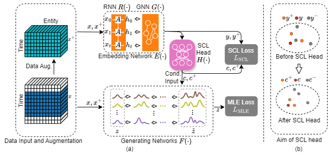
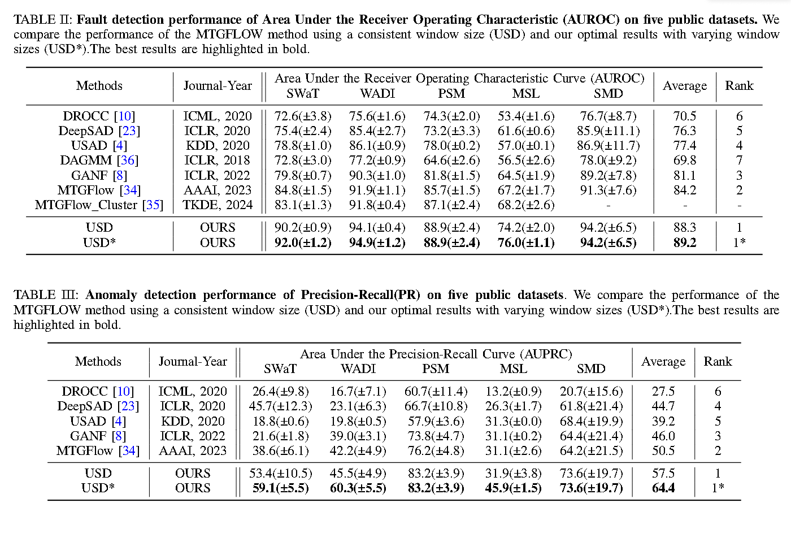

# USD: Unsupervised Soft Contrastive Learning for Fault Detection in Multivariate Time Series


This repository provides a PyTorch implementation of USD, which combines data augmentation and soft contrastive learning to enhance the detection of anomalies in multivariate time series. This repository is based on [`MTGFlow`](https://github.com/zqhang/MTGFLOW).

## Framework


## Main results


## Requirements
```plaintext
torch==2.2.1
numpy==1.26.4
torchvision==0.17.1
scipy==1.11.3
scikit-learn==1.3.2
matplotlib==3.8.1
pillow==10.2.0
wandb==0.15.12
pandas==2.1.1
```


```sh
pip install -r requirements.txt
```

## Data
We test our method for five public datasets, e.g., ```SWaT```, ```WADI```, ```PSM```, ```MSL```, and ```SMD```.

[`SWaT`](https://itrust.sutd.edu.sg/itrust-labs_datasets/dataset_info/#swat)
[`WADI`](https://itrust.sutd.edu.sg/itrust-labs_datasets/dataset_info/#wadi)
[`PSM`](https://github.com/tuananhphamds/MST-VAE)
[`MSL`](https://github.com/khundman/telemanom)
[`SMD`](https://github.com/NetManAIOps/OmniAnomaly)

```sh
mkdir Dataset
cd Dataset
mkdir input
```
Download the dataset in ```Data/input```.
You can obtain the well pre-processed datasets from [`Google Drive`](https://drive.google.com/drive/folders/1ZqZmcJjDO4I5-wA1S7QzqAa-GFvjD5Xv?usp=sharing)
## Run the code
For example, run the USD for the dataset of  ```SWaT```
```sh
python main.py --alpha=0.1 --batch_size=128 --k=10 --loss_weight_manifold_ne=5 --loss_weight_manifold_po=1 --lr=0.01 --n_blocks=1 --name=SWaT --seed=18 --train_split=0.6 --window_size=60
```

- train for ```DROCC```, ```DeepSAD```,  ```DAGMM```, and ```USAD```. 
```sh
python train_other_model.py --name SWaT --model USAD
```
- train for ```GANF``` and ```MTGFLOW```
We report the results by the implementations in the following links: 

[`GANF`](https://github.com/EnyanDai/GANF) and [`MTGFLOW`](https://github.com/zqhang/MTGFLOW)

## BibTex Citation

